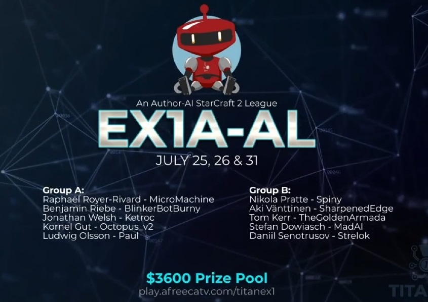
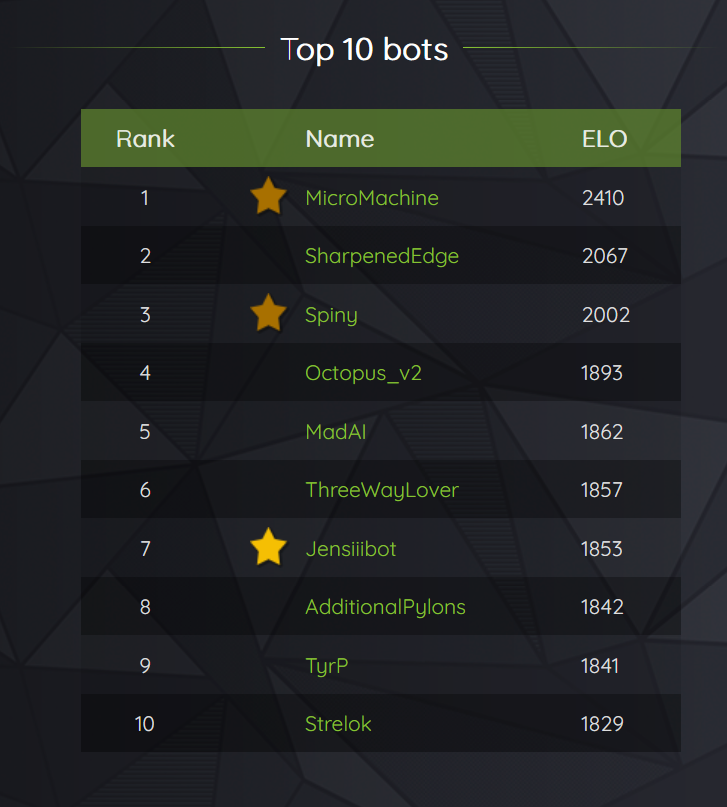

# Octopus
Gaming bot for real time strategy - StarCraft2

[*Check out new version*](https://github.com/takado8/starcraft2_ai_octopus_v3)

## Achievements

-  Octopus participated in the Korean EX1A-AL tournament - [Watch octopus on EX1A-AL Tournament](https://vod.afreecatv.com/ST/59563399?change_second=16543)

- [AI Arena Season 1](https://aiarena.net/competitions/stats/40/octopus_v2-ai-arena-season-1) - Top 4

- [Starcraft 2 AI Ladder Season 9](http://archive.sc2ai.net/index.php?season=9) - Octopus qualified for the tournament, took 3rd place in group elimination.

## Project structure

 
